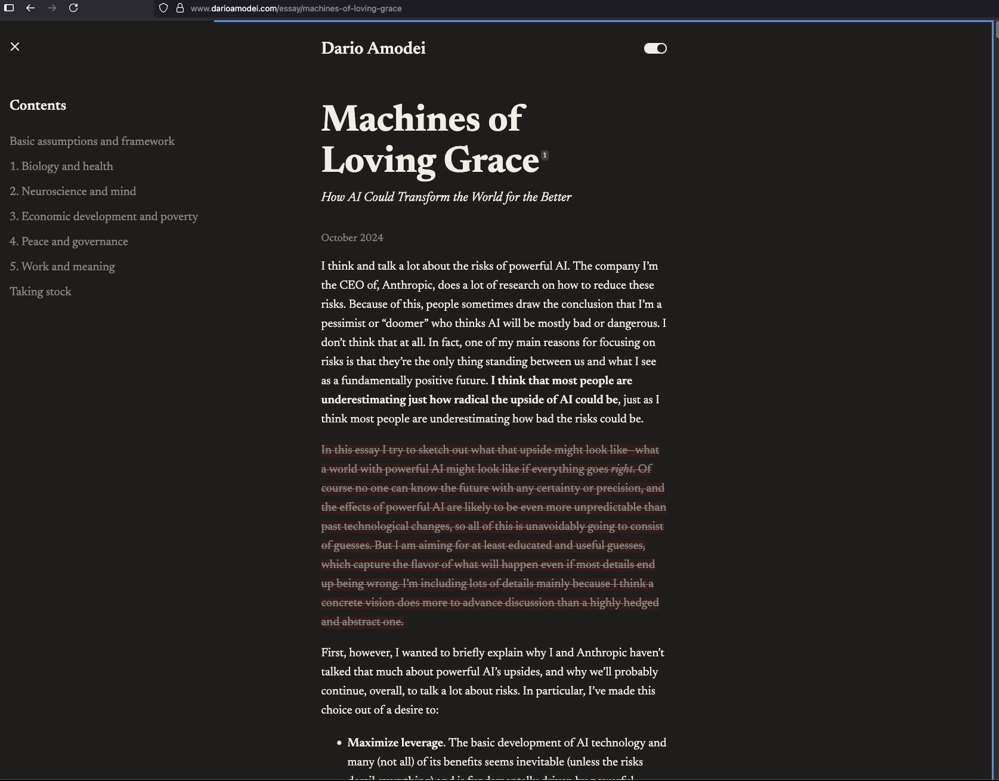
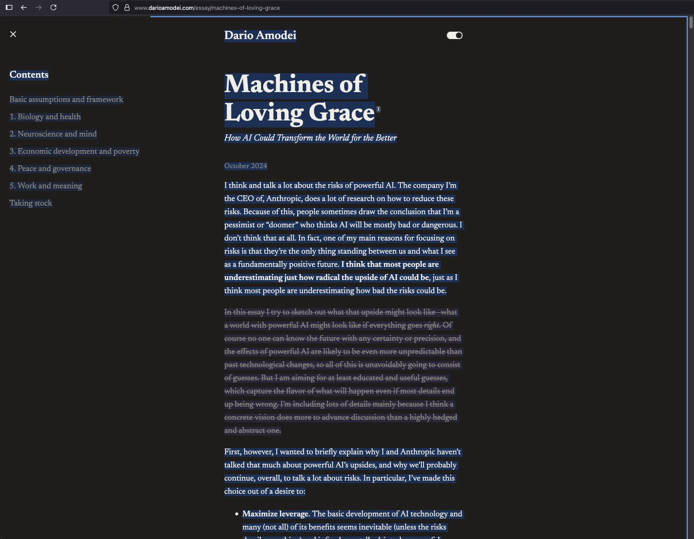

# Copy Text Exclude

Firefox extension for copying text from webpages while excluding unwanted portions.

**Note:** Does not work on PDF files viewed in the browser.

## How to Use

1. **Press `Cmd+Shift+E`** (Mac) or `Ctrl+Shift+E` (PC) → Blue border appears

2. **Select text to exclude** → Gets strikethrough (repeat as needed)

3. **Select what to copy** or press `Cmd+A` for all

4. **Press `Cmd+C`** → Copies without the strikethrough text

5. **Exit**: Press `Escape` or `Cmd+Shift+E`

## Installation

1. Open Firefox → `about:debugging`
2. Click "This Firefox"
3. Click "Load Temporary Add-on"
4. Select `manifest.json` from the extension folder

## Example in Action

### Before (Exclusion Mode Active)

*Blue border indicates exclusion mode is active*

### After (With Exclusions Marked)

*Blue highlighting shows text marked for exclusion*

Text on page: `This is a paragraph with unwanted ad text in the middle.`

After excluding "unwanted ad text" and copying:
`This is a paragraph with in the middle.`

## Features

- Works on any website including Google search results
- Select text in links without opening them
- Mark multiple exclusions before copying
- Auto-clears after copying
- Privacy-focused - no data collection